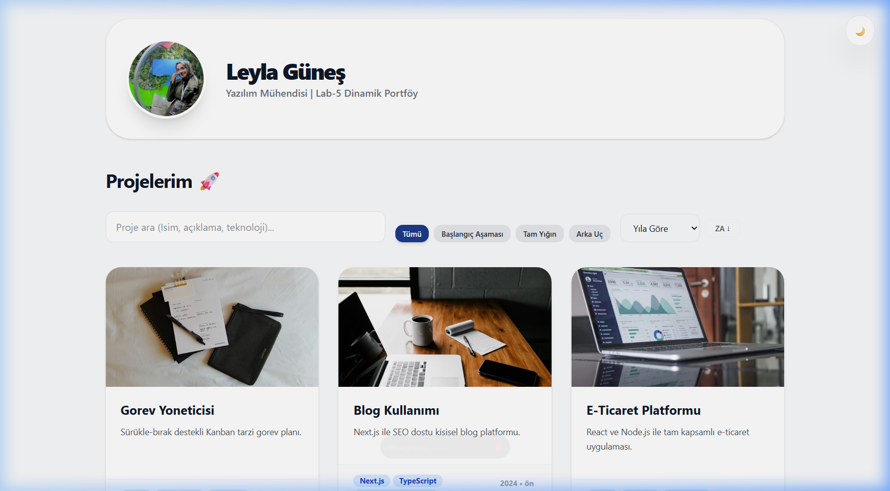
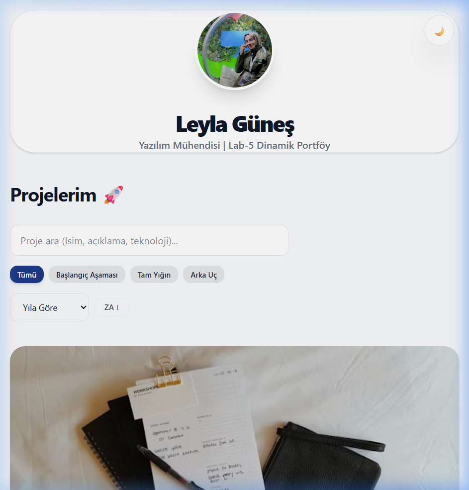
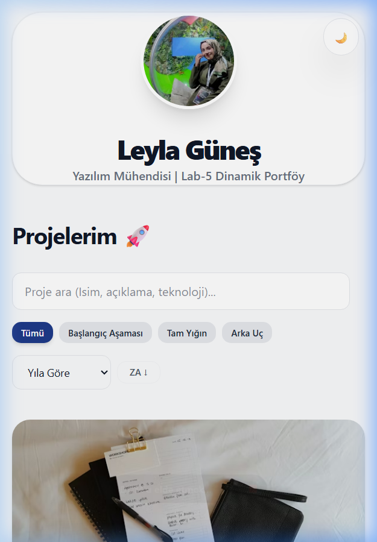

# Web LAB -1 - Hello Project 🚀

## Hakkında
Bu proje, **Fırat Üniversitesi Web Tasarımı ve Programlama** dersi kapsamında LAB-1 ödevi olarak başlayıp, 5 haftalık bir süreçte modernize edilerek hazırlanmış kapsamlı bir portfolyo uygulamasıdır.

Proje, modern web geliştirme araç zinciri kullanılarak **Vite + React + TypeScript** ile oluşturulmuş, **Tailwind CSS v4** ve **Dinamik Veri Yönetimi** ile güçlendirilmiştir.

---

## 📸 Görünüm (Screenshots)
Sitenin farklı cihazlardaki kusursuz ve duyarlı (responsive) görünümü:

| Masaüstü (1440px) | Tablet (768px) | Mobil (375px) |
| :---: | :---: | :---: |
|  |  |  |

---

## 🏅 Lighthouse Skoru - Erişilebilirlik Kanıtı
Web erişilebilirliği testlerinden **tam yetki (100/100)** alarak onaylanmıştır.


> **Not:** Temiz HTML5 semantik yapısı, WAI-ARIA standartları ve klavye dostu navigasyon (Skip Link) sayesinde en yüksek erişilebilirlik elde edilmiştir.

---

## 👤 Geliştirici Bilgileri
- **Ad Soyad:** Leyla Güneş
- **Öğrenci No:** 235541098
- **Ders:** Web Tasarımı ve Programlama
- **Üniversite:** Fırat Üniversitesi

---

## 🛠️ Kullanılan Teknolojiler
- **Core:** React 18 & TypeScript
- **Styling:** Tailwind CSS v4 (Modern Theme Engine)
- **Tooling:** Vite, Node.js
- **Version Control:** Git & GitHub

---

## 📂 Proje Yapısı
```text
web-lab-hello/
│
├── screenshots/            # Proje ekran görüntüleri
├── public/                 # Statik varlıklar ve JSON verileri
│   └── data/projects.json  # Merkezi Proje Veri Tabanı
│
├── src/
│   ├── components/         # Yeniden kullanılabilir UI bileşenleri
│   ├── services/           # API ve Veri çekme servisleri
│   ├── types/              # TypeScript veri modelleri
│   ├── utils/              # Filtreleme ve sıralama yardımcıları
│   ├── App.tsx             # Ana uygulama component'i (Dinamik)
│   └── main.tsx            # Giriş noktası
│
├── profile.jpg             # Geliştirici Profil Fotoğrafı
├── CSS-KARARLARI.md        # Teknik Tasarım Kararları Dokümanı
├── package.json            # Bağımlılıklar
└── vite.config.ts          # Vite & Tailwind v4 Ayarları
```

---

## 🚀 Kurulum ve Çalıştırma

### 1. Kurulum
```bash
npm install
```

### 2. Çalıştırma
```bash
npm run dev
```
Ardından tarayıcıda şu adresi açın: `http://localhost:5173`

---

## 📉 Git İş Akışı ve Branch Yönetimi
Bu projede akademik standartlarda, kademeli bir Git akışı uygulanmıştır:

| Hafta | Branch | Teknik Odak |
| :--- | :--- | :--- |
| **Hafta 1** | `main` | Temel kurulum ve Hello World. |
| **Hafta 2** | `feature/personalize-ui` | İçerik özelleştirme ve profil hazırlığı. |
| **Hafta 3** | `feature/responsive-layout` | CSS Token ve Esnek Tasarım. |
| **Hafta 4** | `feature/tailwind-ui-kit` | Tailwind v4 ve UI Kit kütüphanesi. |
| **Hafta 5** | `feature/typescript-projects` | Dinamik veri çekme ve filtreleme. |

---
**Geliştirici:** Leyla Güneş &bull; 2025
